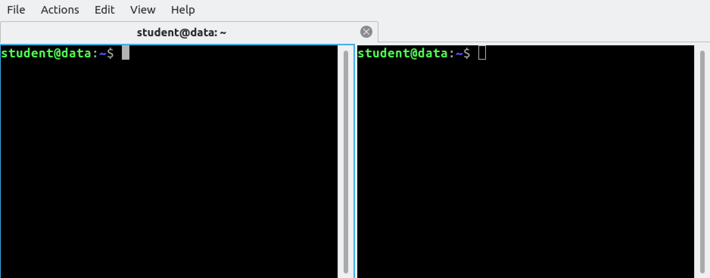

# Using Spark Structured Streaming for WordCount

This code example implements the WordCount example on a stream of data.

Open your terminal window. Right click in the window, as select `Split Terminal Vertically`.
You should see something like this:


We will use the left window for generating events, and the right window for running the Spark code.

```bash
# Left window: Start a socket connection on port 9999.
nc -kl 9999

# Right window: Start the Spark command-line interface
spark-shell
```

Use the right window to run the following code.
> **IMPORTANT** 
> 
> Pasting multi-line scala code into the CLI will not work properly. 
In order to do that correctly, type in `:paste` first, then you can paste the code
with `Ctrl+Shift+V`. Exit paste mode with `Ctrl+D`, as suggested.

```scala
// Disable debug log for a cleaner output
spark.sparkContext.setLogLevel("ERROR")

// Define input stream
val lines = spark.readStream
  .format("socket")
  .option("host","localhost")
  .option("port","9999")
  .load()
  
// Check if we have a streaming DataFrame
lines.isStreaming

// Define the transformation
val wordCounts = lines
  .as[String]
  .flatMap(_.split(" "))
  .groupBy("value")
  .count()
  
// Is it a streaming DataFrame?
wordCounts.isSteaming
```

Check the Spark UI. Did anything happen?

http://10.0.2.15:4040 (your URL might be different, check spark-shell's output)

```scala
// Let's create the output stream
val query = wordCounts.writeStream
  .format("console")
  .outputMode("update")
  .start()
  .awaitTermination()
```

Start typing lines in the left window. Check the output of the right window.

Check Spark UI again

When finished, exit both applications with `Ctrl+C`.
